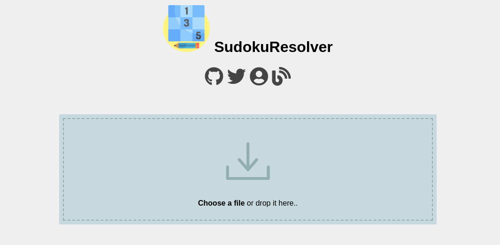

# SudokuResolver

A computer vision python program to resolve sudoku taken from a camera.

SudokuResolver is live! Test it [there](http://projects.victormeunier.com/sudoku/sudoku.html)

## End-to-end deep learning method

*Under construction*

The goal with this method is to reduce the amount of "manual" work that has to be done. By manual work, I mean image pre processing before trying to extract the numbers. With this method, from any image, the neural net is going to identify the location of the object (a digit) and classify it.

### YOLOv3

To achieve the end-to-end deep learning method, I chose to use Yolo v3 as my object detection model. I've retrained it on digits and then pruned and quantized to reduce its size and get better inference speed.

One could say that its a bit overkill for such a simple task, and it is! The idea here, is really to compare two methods. One could also try to use TinyYOLO instead of the full model. Performances should be more than enough but with much less computational power requirement.

See my [github repo](https://github.com/MrEliptik/YOLOv3_digits.git) for more information about this model.

## 'Classic' computer vision method

Using classic computer vision, we'll have to apply different preprocessing to identify the sudoku grid in the image, and then extract each cell to get the numbers. Once we have an image for each number, we can apply different techniques to identify it. I chose a simple CNN, which is not a really classic computer vision technique, but performs really well.

### Steps

From left to right, top to bottom:

    
    
    
    
    
    
    
    
    

1. Orignal
2. Gaussian blur (remove noise)
3. Adaptive threshold to have a B&W image
4. Dilate to fill in the gaps
5. Contours (the biggest will be the grid)
6. Corners of the biggest contours
7. Crop + fix perspective
8. Apply the "ideal" 9x9 grid, extract each cell
9. Extracted digit re-applied on a perfect grid

## File structure

- **data**        : Contains 10 folders, one for each digit (1167 examples)
- **examples**    : Contains images at different stage of the processing
- **ressources**  :
  - **img**               : Input image(s) to test
  - **models**            : Different Keras CNN models for digit classification
- **src**         : All the python scripts
  - *extracter.py*      : The entry point, where all the magic happens
  - *solver.py*         : Algorithm(s) to solve the sudoku
  - *alterateImages.py* : Function(s) to alterate images (crop, skew, rotate)
  - *addBadImages.py*   : Add 150 alterated images to each digit class
  - *buildDataset.py*   : Is used by buildMnist.py to create a dataset in memory
  - *buildMnist.py*     : Create, train, test and save a CNN model

## Requirements

Simply type:

    pip install -r requirements.txt

or see the following depency list:

- Keras==2.2.4
- numpy==1.15.4
- imutils==0.5.2
- opencv_python==3.4.3.18
- scikit_learn==0.20.1

## TODO 
- [x] Add a web interface
- Re-train CNN with MNIST data (hand writtten digit) & test perfomance
- Use an RCNN to localize digits
